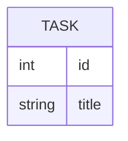

# データモデル

## ER 図

## エンティティ

| ID | エンティティ | 説明 | 主な属性 | ライフサイクル | 検証 | 上流 |
|----|--------------|------|----------|----------------|------|------|
| DM-<ENT> | | | | <作成→更新→削除の条件> | review | REQ-DATA-001 |

## 関連

| ID | 関連 | 多重度 | 削除時の扱い | 検証 | 上流 |
|----|------|--------|--------------|------|------|
| DM-<ENT>-R01 | | | | test | REQ-... |
