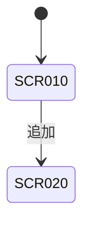

# 画面一覧

## 画面

| ID | 画面名 | 目的 | 仕様 | 検証 | 上流 |
|----|--------|------|------|------|------|
| SCR-010 | <画面名> | <目的> | [SCR-010.md](SCR-010.md) | review | REQ-<区分>-001 |

## 画面遷移

| ID | 遷移元 | 契機 | 遷移先 | 検証 | 上流 |
|----|--------|------|--------|------|------|
| TRN-001 | SCR-010 | <操作 SCR-010-A01> | SCR-020 | test | REQ-<区分>-002 |

## 画面 ID ↔ デザイン対応表

入口: [../designs/index.html](../designs/index.html)。デザインの場所は `<ファイル>#<状態ID>` (ファイルの構成は自由)。

| 画面 ID | 状態 | 状態 ID | デザイン |
|---------|------|---------|----------|
| SCR-010 | 通常 | SCR-010-S01 | [SCR-010.html#SCR-010-S01](../designs/SCR-010.html#SCR-010-S01) |
| SCR-010 | 空 | SCR-010-S02 | [SCR-010.html#SCR-010-S02](../designs/SCR-010.html#SCR-010-S02) |
